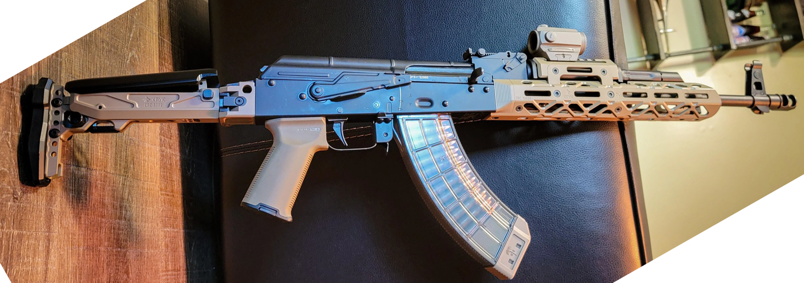
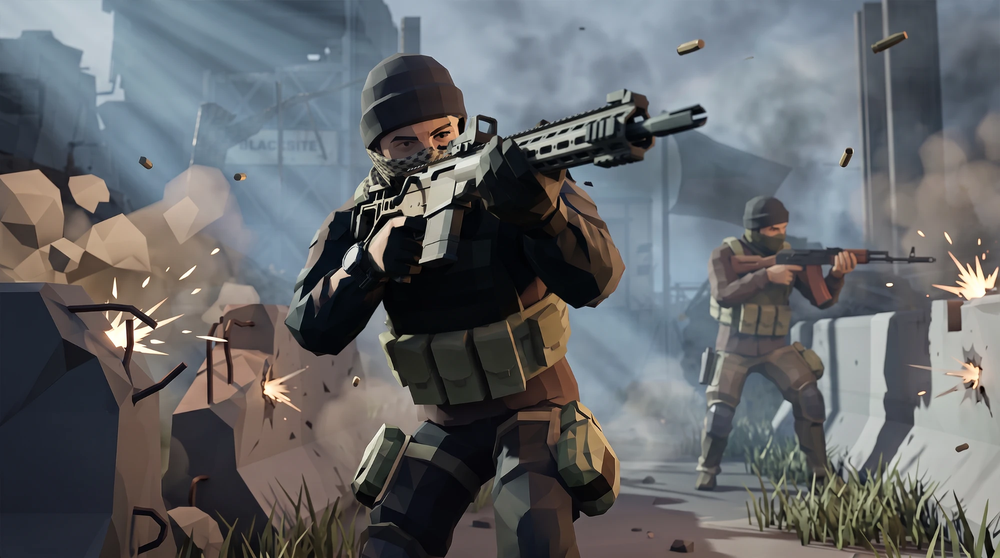
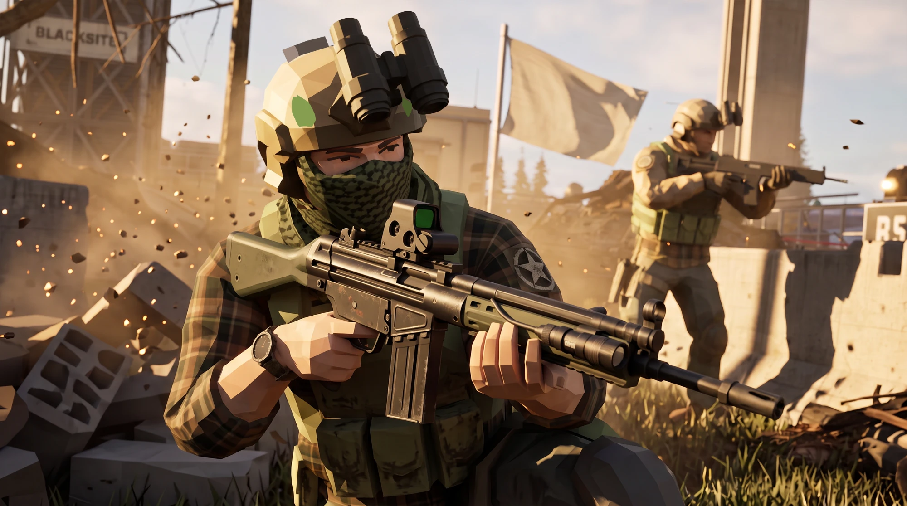
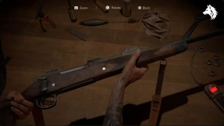
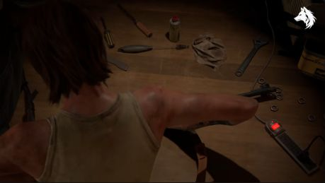
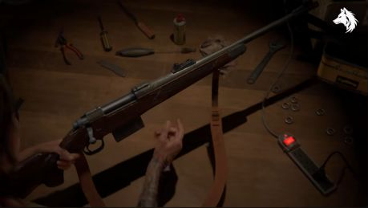
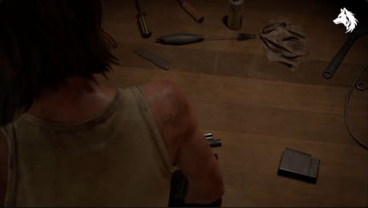
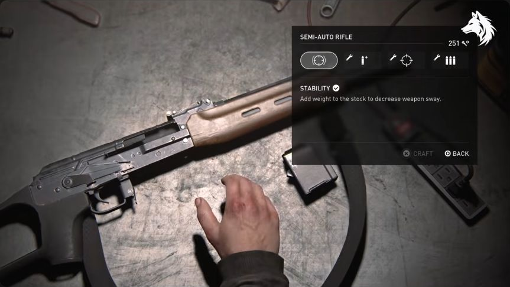
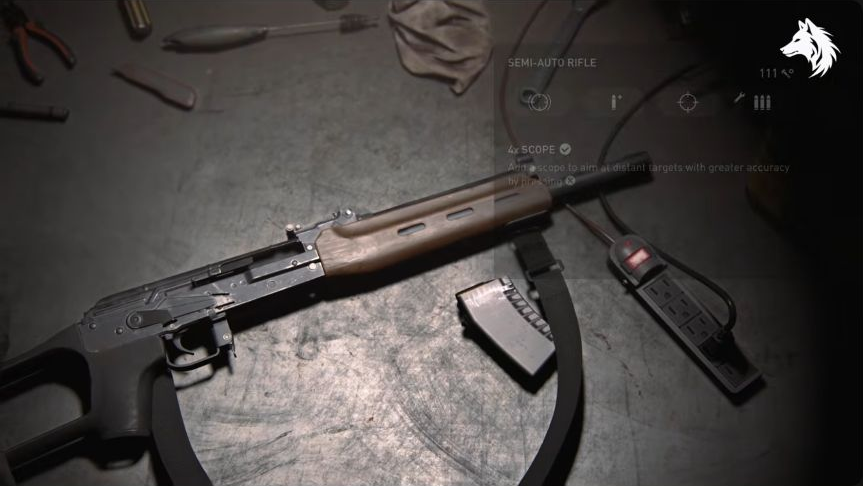

# Partisan — master roadmap

Updated 30 September 2026. Consolidated against main at `042383b`, fetched before this edit. **Development remains paused.** This consolidation changes documentation only; it does not authorize implementation or promote experimental features into the default experience.

This is the single maintained roadmap for the Partisan demo. It supersedes the customiser, broader Partisan, content-roster and workbench-animation roadmaps. Their former paths remain as pointers. Existing implementation and verification records below are inherited checkpoints, not fresh acceptance-test results from this documentation pass.

## 1. Product boundaries and status

The default flow remains **workbench opener → Full Customiser**. Normal weapon editing and future weapon/attachment content belong in the Full Customiser. All new bench editing, articulated hands, staged part changes and advanced handling audio stay behind **Load Advanced animations test**, accessible from the opener and Full Customiser. No animation phase implies changing that default flow.

- [Open the normal experience](../ak15-workbench-intro/).
- [Open the Full Customiser](../ak15-workbench-intro/?view=customiser).
- [Load Advanced animations test](../ak15-workbench-intro/?view=advanced).
- Operator and Field exist as procedural prototypes but remain parked; development access uses `?screens=all` on the nested customiser. Re-exposing them is a separate product decision.

Status vocabulary: **Implemented** means recorded in the current code/checkpoint, not universally validated; **Prototype** means working coverage with unfinished acceptance gates; **Planned** means remaining scope; **Blocked** means a stated dependency is unresolved; **Optional** means outside the required delivery path.

| Track | Current state | Remaining outcome |
|---|---|---|
| Default opener and Full Customiser | Implemented; original flow restored | Preserve routes, saved builds and ordinary editing |
| Weapon depth | Implemented foundation: stats/deltas, compatibility checks, presets, finishes/camo/wear, test fire | General rail footprints/rules, additional slots, broader platform coverage |
| Weapon roster | Two AK variants implemented; content expansion planned | G3A3, modern platforms, then historical modernisations subject to cleared assets |
| Operator | Procedural creator implemented; parked | Art-directed skinned base, outfits and clipping acceptance |
| Field | Procedural IK, poses, breathing/sway/recoil/reload implemented; parked | Broader combination coverage and eventual clip/rig integration |
| Sharing and range | Photo mode, loadout card, hash state and range prototype implemented | Verify exports, versioned codes/backward compatibility, optional visual polish |
| Advanced animations | P0–P6 prototype coverage; paused | Contact polish, listening/source review, complete matrix and device acceptance |
| Production | Compression, adaptive resolution, reduced motion and first-run hint implemented | LOD/tooling decisions, full accessibility and measured performance |

### Completed foundation — do not recreate as backlog

The original customiser Steps 1–6 and checked Step 7 entries delivered the base viewer, real AK-74M and AK-15K, rotatable HDR lighting, slot/mount registry, rail offsets, illustrative attachment library, per-part finishes, URL builds, swap/fold/slide transitions and mobile layout. Later additions include the drum, side-rail light/laser/combo, suppressor colours, presets and per-slot cameras. These are existing features, not new roadmap tasks.

Historical music defaults (ambient 18%, then Abdulena 40%) have been superseded. The current default is “The Duce Puts On His Uniform” at 36%, with saved preferences and parent-shell continuity. Weapon appearance code now includes `rifle-finishes.js`; old references placing all finish logic in `viewer.js` are obsolete.

## 2. Delivery order and dependencies

No dates are committed. Earlier estimates were initial scope estimates, not remaining effort after the prototype work; re-estimate when development resumes.

| Order / ID | Deliverable | Dependency / exit |
|---|---|---|
| M0 | Maintain default/advanced separation and this status inventory | Already established; regression constraint for every later change |
| M1 | Full Customiser content stage 1 plus remaining weapon depth | Cleared attachment assets and G3A3; three weapons, meaningful rules/deltas, presets and test fire |
| M2 | Modern weapon roster, then historical modernisations | Per-asset clearance and integration; see exact stage exits below |
| M3 | Operator art and layered outfits | Setting/art direction, asset policy and compatible skeleton; two bases or agreed adjustable equivalent, around eight outfit slots, 3–5 options per slot, no clipping in agreed poses |
| M4 | Weapon/character integration | M3 and per-weapon contacts; five smooth poses, supported weapon/grip/stock combinations reviewed |
| M5 | Sharing and Field presentation | Stable loadout state and M4 for final operator imagery; exports and old/new share-code round-trips |
| M6 | Production acceptance | Relevant supported features complete; performance, input, accessibility and asset checks pass |
| X0–X6 | Advanced animation experiment (formerly P0–P6) | Separate optional track, currently paused; its own phase table and release gates below |

Content can progress independently of advanced animation polish. New weapons are not automatically supported by the advanced experiment: add explicit contact/clearance profiles and acceptance coverage before declaring support. Field improvements likewise do not automatically change the default navigation.

## 3. Full Customiser — remaining weapon depth

Preserve existing illustrative stats and hover deltas; extend per-option ergonomics, recoil, mass, length, sound signature, ADS and handling consistently without claiming measured real-world performance. Extend declarative `requires`, `excludes` and `replaces` rules with visible reasons. Generalise rail length, pitch and attachment footprints so incompatible placements cannot overlap.

Side-rail light/laser/combo already exists. Remaining slot candidates are sling mount, charging handle, trigger and a separate dust-cover rail; extra folding-stock variants remain optional content. Preserve presets, camo, wear, finish controls and muzzle-dependent test fire while expanding the roster. The older generic LMG/DMR/pistol examples are superseded in priority by the concrete roster below; a pistol is an optional later candidate.

**Weapon-depth exit:** at least three supported weapons, visible compatibility restrictions, hover deltas, presets and test-fire sound. Existing features need regression coverage rather than reimplementation.

## 4. Weapon and attachment content

The source leads below are preserved from Claude's content roadmap. License labels such as “confirmed” describe that document's prior assessment, **not a fresh verification during consolidation**. Check the exact asset and terms before importing it. Keep the existing CC0/CC BY-only rule unless the owner explicitly changes it; a paid or royalty-free asset is not automatically eligible.

Asset pipeline: strip loose/duplicate geometry, normalise node names/parts/sockets, meshopt-compress, add factory/library options in `models.js` and `attachments.js`, retain reproducible source-processing scripts, and add visible Credits. Validate dimensions, materials, loadout persistence and supported slot combinations.

### Stage 1 — Real assets, no placeholders; add the G3A3

Today's muzzle devices, optics, foregrips, magazines, grips and stocks in
`attachments.js` are low-poly shapes built in code from the AK model's own materials
("illustrative shapes, not measured replicas" — `ROADMAP.md` Step 4). Stage 1 swaps as
many of these as practical for real downloaded models, and adds one new rifle.

| Item | Source | Licence | Notes |
|---|---|---|---|
| Generic attachment donor pack | [Low Poly Weapon Pack](https://opengameart.org/node/187893) by byzmod3d, OpenGameArt | **CC0**, confirmed | `.obj` pack; also the easiest source for Stage 2's M16 and Stage 3's STG44 bases (see below) — one download covers three roadmap items |
| Modular parts reference | [Low Poly Firearms](https://chilly-durango.itch.io/low-poly-firearms) by chilly-durango, itch.io | **CC0**, confirmed | AK/M4/AUG/SMGs with slides, mags, triggers as separate meshes — useful as a *second* geometry reference for building real optic/grip/stock shapes to replace the code-built ones, since it's already modelled part-by-part |
| Optics/suppressors/rails, none found as a ready CC0 pack | — | — | No free tactical-attachment pack surfaced in this pass (only paid ones: Superhive "25 Tactical Attachments", Gumroad "Tactical Gun Attachments"). **Open item**: either license-check a paid pack against this project's CC0/CC BY-only rule (likely a no), or keep building these low-poly in code but modelled closer to real references (measured, not illustrative) |
| G3A3 | [3DCADBrowser G3A3](https://www.3dcadbrowser.com/3d-model/g3a3) | **license: verify** — 3DCADBrowser models are usually royalty-free-for-use rather than CC0/CC BY, so check the exact terms before treating it like the Sketchfab downloads | No CC0/CC BY G3A3 surfaced on Sketchfab in this pass; if the licence doesn't clear, search Sketchfab directly for "G3" or "CETME" (same roller-delayed blowback family, visually close) as a substitute base |

Exit criteria: at least the magazine, one muzzle device and one optic are real downloaded
geometry instead of code-built primitives; G3A3 shipped as a third rifle in `models.js`.

### Stage 2 — Modernized RPK, modernized M16, Mk14 EBR, SIG Spear

| Item | Source | Licence | Notes |
|---|---|---|---|
| M16 (base for "modernized") | [Low Poly Weapon Pack](https://opengameart.org/node/187893) (`m16.obj`) — same CC0 pack as Stage 1 | **CC0**, confirmed | Also: [M16 A4](https://gintoki1234.itch.io/m16-a4) by Gintoki1234, itch.io, **CC BY 4.0** (needs credit) as a second, more detailed option |
| Modernized RPK | none found | — | No CC0/CC BY RPK surfaced. Best lead: check [D_U's Sketchfab catalog](https://sketchfab.com/DU1701) directly — the same creator as the current AK-74M and AK-15K (both CC BY 4.0), so an RPK from them would match the existing art style exactly. Otherwise, kitbash: the customiser already simulates an RPK-style 40-round magazine on the AK-15K; a full RPK could reuse the AK-74M/AK-15K receiver plus a longer barrel and bipod bashed in. Target look: see the reference photo below |
| Mk14 EBR | [Sketchfab: notcplkerry](https://sketchfab.com/notcplkerry) (animated Mk14 EBR) and [Sketchfab: samanthacford](https://sketchfab.com/samanthacford/models) (Low Poly MK14) | **license: verify** — neither model's licence was visible from search results; open each page and check before download | Two independent leads is a good sign something downloadable exists; whichever clears the CC0/CC BY bar wins |
| SIG Spear (MCX-SPEAR) | none free found | — | Only paid results: [Sig Sauer MCX Shrike](https://sketchfab.com/3d-models/sig-sauer-mcx-shrike-72b04e481e9c403cbb3b702176628ea6) (Sketchfab, premium, 79k tri — too dense anyway), [3DMilitaryAssets XM7 MCX Spear](https://3dmilitaryassets.com/products/sig-sauer-xm7-mcx-spear) ($30). The hardest item on the whole roadmap to source for free — likely needs a code-built placeholder (matching this project's existing Stage-1-style approach) until a CC0/CC BY upload appears, or a paid-asset decision from the project owner |

**Modernized RPK target look** (owner-supplied reference photo, 30 September 2026): whichever base gets sourced for this slot, re-fur it toward this silhouette — KPOS-style folding/adjustable stock, M-LOK handguard, flip-up back-up sights paired with a red-dot, translucent polymer magazine — rather than the plain furniture on the current AK-74M/AK-15K. Reference only; not a licensed asset to import as-is.

Exit criteria: RPK, M16, Mk14 EBR and SIG Spear each have a `models.js` entry; any slot
still without a cleared real asset stays clearly marked illustrative/placeholder rather
than silently shipped as if it were the real thing.

### Stage 3 — WW2 kitbashes into modern-looking variants

STG44 and PPSh-41 → M4 Custom, AK, "PPSh" builds; take the WW2 shape and re-skin/re-part
it with modern furniture (rail, red dot, foregrip) the way the AK attachments already work.

| Item | Source | Licence | Notes |
|---|---|---|---|
| Modernized STG (44) | [Low Poly Weapon Pack](https://opengameart.org/node/187893) (`stg44.obj`) — same CC0 pack as Stage 1 & 2 | **CC0**, confirmed | Third item out of the same single download |
| Modernized PPSh | [mini pack of weapons of the second world war](https://victorcstr.itch.io/mini-pack-of-weapons-of-the-second-world-war) by victorcstr, itch.io — includes a PPSh-41 with its drum/box mags and ammo | **license: verify** — not stated in search results, check the itch.io page | Also several paid PPSh-41 options on CGTrader/TurboSquid/Fab if this one doesn't clear |
| Modernized Bren | none found | — | No CC0/CC BY Bren surfaced. Leads to check by hand: [bigmack's WWII Mega Gun Pack](https://bigmack.itch.io/wwii-mega-gun-pack), [jimhatama's World Wars Weapons Pack](https://jimhatama.itch.io/world-wars-weapons-pack), [marmok1932's Soviet Weapons Pack](https://marmok1932.itch.io/soviet) — general WW2 bundles that may or may not include one; none confirmed to contain a Bren in this pass |
| Modernized Chauchat | none found | — | The rarest weapon on this whole roadmap as a free asset — a WWI French LMG gets modelled far less often than WW2 subjects. No lead surfaced at all in this pass. Likely needs either a from-scratch build (code-built, like today's attachments) or a commissioned/paid model if the project wants it sooner than "whenever someone uploads one" |

Exit criteria: STG and PPSh shipped as modernized kitbash builds (real base geometry,
modern furniture); Bren and Chauchat at minimum have a confirmed source lined up, even if
not yet built.

### Open items carried forward

- No free tactical-attachment pack (optics/suppressors/rails) was found; Stage 1's
  attachment upgrade may end up "better code-built shapes" rather than "downloaded parts"
  unless one turns up.
- Four items across the roadmap have no confirmed free source yet: SIG Spear, RPK, Bren,
  Chauchat. Checking D_U's Sketchfab catalog directly (rather than by search) is the
  single most promising unopened lead, since it's the exact art style already in use and
  already cleared for this project once.
- Every "license: verify" row must be individually opened and checked — CC0/CC BY only,
  same bar as the existing README's Models section — before any download is added to the
  repo or `model-source/`.

**Stage 1 scope reconciliation:** better code-built shapes are a permissible interim fallback, but they do not satisfy the stated downloaded-geometry exit. An uncleared G3A3 source likewise leaves that milestone open. Do not silently mark the stage complete or substitute a different rifle without documenting the scope change.

**Stage 2 scope reconciliation:** clearly labelled illustrative placeholders may satisfy registry coverage, but are not cleared real-asset delivery. Track those two outcomes separately.

**Stage 3 scope reconciliation:** STG44 and PPSh are implementation deliverables; Bren and Chauchat only require confirmed sources at this stage. Chauchat is a WWI-origin platform grouped here for the historical-modernisation workstream.

## 5. Operator, Field and sharing

These are the broader Partisan demo tracks, not requirements to re-enable parked screens now. The original statement “there is no character yet” is obsolete: the procedural creator and IK spike exist. They do not replace the planned skinned asset, morphs or retargeted clips.

### M3 — character art and customisation

**Target look** (owner-supplied keyframes, 30 September 2026): low-poly but readable at speed — faceted geometry, painterly flat-shaded materials, legible silhouette for mask/helmet/plate-carrier/patch layers, held together by rim light and dust/impact FX rather than surface detail. Judge the M3 base and rig against this bar before investing in a full wardrobe. Reference for style only, not a source asset.

- Select a low-poly standard-skeleton base compatible with the rifle style: male/female bases or an agreed adjustable base, with build, height and face morphs. Quaternius/Kenney or commissioned art remain candidates, not selected assets.
- Extend the existing procedural creator into layered head, face, torso, legs, feet, hands, vest, backpack and patch slots. Cull hidden body regions and test clipping across outfit combinations.
- Preserve shared clothing/weapon camo and palettes; extend fabric wear/dirt, faction patches and armbands once setting and insignia direction are settled.
- Provide face and outfit-slot framing. Judge final bases next to existing rifles before investing in a full wardrobe.

### M4 — weapon on character

Preserve the existing two-bone IK and procedural poses. Author per-weapon pistol-grip, support-hand and cheek contacts, foregrip-dependent targets and folded-stock stance changes. Add or retarget idle, ready, aim, low-ready, reload and inspect clips when a compatible rig exists. Use illustrative build mass to inform restrained posture and handling feedback. Every declared weapon/foregrip/stock combination needs visual contact review; a smoke test cannot certify lack of clipping.

### M5 — sharing and presentation

Photo mode, loadout cards, hash state and a stat-driven range drill already exist. Audit the implemented subset before adding pose/lighting/backdrop controls, optional depth of field, PNG export with subtle branding and a complete operator/weapon/stats card. Add versioned compact base64url loadout codes only with backward-compatible old AK hashes. Verify weapon, operator, mode and pose survive round-trip, refresh and navigation; parked modes must respect the current navigation policy.

The range remains optional, one scene with five targets/timer and illustrative recoil feedback. Do not turn it into a separate game. Its existing prototype is not proof of final performance or input acceptance.

## 6. Shared architecture and production

Retain the current static Three.js delivery and valid nested URLs. Shared loadout state should describe weapon build/finish/rails and operator base/morphs/outfit/colours/insignia; views must not silently diverge. Generalise option semantics across registries where useful, keeping original/build/pose, compatibility, stats and finishes explicit.

Shared rifle/state/appearance modules already exist. The advanced scene uses `advanced-workbench.js`, `bench-session.js`, `bench-actions.js`, `bench-motion.js`, `bench-hands.js` and `bench-audio-cues.js`; ordinary opener code stays in `workbench.js`. Do not import the full DOM-owning viewer into either scene. Contact/pose data can evolve within those boundaries; earlier proposed `bench-poses.js` and `bench-contacts.js` filenames were not mandatory deliverables.

Vite is a conditional tooling decision if rig/clip/decoder complexity warrants it, not a prerequisite imposed by the old phase-C schedule. Preserve URL compatibility through any migration. Existing meshopt compression, adaptive resolution, mobile shadow limits and preload remain; evaluate texture atlases, lazy outfit/weapon loads and LOD against actual budgets.

Production backlog: complete a short guided first run (preset → part → stat change; include Operator only if exposed); consistent screen audio and UI cues; keyboard operation, focus, reduced motion, colour-independent stat deltas and captions if voice lines are introduced. Optional analytics must remain privacy-light and opt-in. GLB build export is deferred and must include applicable attribution.

Original mobile ambitions were 60 fps Armoury/Operator and 30 fps Field; advanced targets are 60 fps desktop / 30 fps selected mid-range phone. These are goals, not measured achievements. Record device/browser, cold/warm load, frame-time percentiles and memory under repeated actions before choosing final budgets.

## 7. Advanced animations — paused prototype checkpoint

All material in this track applies exclusively to **Load Advanced animations test**. Full Customiser editing remains the standard workflow. Former P0–P6 phase identifiers are retained below for source continuity (equivalent to X0–X6 in the master delivery table).

| Phase | Working in the local prototype | Still required for the exit gate |
|---|---|---|
| P0 | Repository integrated at the recorded checkpoint, six timestamped reference stills, existing sample source discrepancy documented | Audition and trace every active audio take; approve the final pose sheet |
| P1 | Shared rifle loading/slot operations, shared appearance, loadout validation, one-commit timeline, rollback, Skip, cancellation and deterministic review checkpoints | Broader failure and repeated-load testing |
| P2 | Persistent bench with inspection/set-down and staged outgoing/incoming optic objects; camera and hand targets | Judge and polish continuous motion at all contact checkpoints |
| P3 | Palm-space wrist solve, articulated fingers/thumbs, contact error readout in review mode | Per-option grip profiles, anatomical silhouette refinement, wrist blending and collision review |
| P4 | Event-driven sample/synth voices, obsolete-cue suppression, cancellation, handling controls, music ducking | Listening review, exact cue envelopes/selection, source clearance and mix verification |
| P5 | Both rifles, all seven slot families, rail moves, in-place stock adjustment, Quick changes and Skip | Verify every model/option extreme and tune each family beyond the common transfer framework |
| P6 | Responsive panel, keyboard controls, reduced-motion skip, saved builds/finishes, viewer return links, capped pixel ratio | Physical-device performance/memory profiling, full input and accessibility audit |

Validation so far: ten automated tests pass. Browser checks passed for all seven attachment families using Skip, optic rollback before commit, switching between both rifles, customiser loading and camouflage/wear-preserving return navigation. The authoring mode at `advanced.html?review=1` pauses at 30%, 38%, 50%, 70% or 82% for repeatable stills. Its palm error metric measures rig reach, not intersections or anatomical realism. No frame-rate or audio-fidelity target is claimed as achieved.

Development paused at the user's request on 30 September 2026. This work-in-progress checkpoint includes the latest remote main changes through ff628f3, followed by the experience split at 042383b. The remaining visual, sound and device acceptance gates are not complete. The next priority is contact and sound review, not declaring the breadth of prototype options production-ready.

## 8. Video reference study and stills

Source: **LunarGaming, “The Last of Us Part 2 Remastered — All Weapon Upgrade Animations (All Guns)”**, [YouTube video](https://www.youtube.com/watch?v=sibhkC6dDJs), published 17 January 2024, duration approximately 16:48. Game imagery: Naughty Dog / Sony Interactive Entertainment. Captures below are reference material, not original Partisan art or runtime textures.

These are selected paused browser captures, cropped to the video image, not a complete frame-by-frame study. Times are recorded player positions, rounded in captions. Still images establish poses, composition and object placement; they do not establish exact velocities, action duration, force or audio timing. The animation durations later in this document are proposed starting values.

The video audio has not been listened to in this analysis. Current sound behavior is assessed from code and repository metadata. Sound texture, source separation and perceptual synchronization remain listening-review tasks. Acoustic classifications in the existing cue sheet are useful candidates, not proof that a sound matches a particular visible action.

### R1 — Supported inspection · 00:11.31

**Observed:** The rifle occupies a strong diagonal, lifted off the table. The hands support different regions; the sling hangs below. Props remain secondary to the rifle.

**Apply:** Author a lifted inspection pose with two explicit contacts, a bounded rotation range and a small torso response. The support hand should follow its local contact on the rifle, not an arbitrary point in world space. A hanging sling is a later visual enhancement, not a prerequisite for the first interaction.

### R2 — Working posture and occlusion · 00:30

**Observed:** The operator leans into the work. Shoulder and upper arm occupy much of the near side of the frame and obscure some of the object.

**Apply:** Use upper-body involvement to sell effort, but establish an occlusion limit for our interface. Move the camera or elbow target when the active mount disappears behind a shoulder. This is a cautionary reference as well as a pose reference.

### R3 — Released hand and hanging sling · 00:45

**Observed:** One hand is clear of the rifle while the other remains in contact; the sling extends well below the object.

**Apply:** Give hands separate contact/release intervals. Add open, cupped and gripping hand poses, with a short wrist follow-through after release. The single frame does not prove the sling's motion curve; any follow-through in Partisan must be authored and reviewed.

### R4 — Loose part has a place · 01:15

**Observed:** A detached magazine occupies a distinct, readable area of the table beside the work.

**Apply:** Define a parts tray region and stable resting transforms. An outgoing part should travel there, remain visible during the action, then be cleared at an intentional transition. Avoid replacement parts appearing from nowhere or intersecting the table.

### R5 — Rifle, hand and menu coexist · 08:38.08

**Observed:** Rifle, detached magazine and near hand are visible together. The upgrade menu occupies the upper-right portion of the frame.

**Apply:** Reserve separate screen regions for the rifle's active work area and the option panel. Maintain readable contact points while the panel is open. Inspect and upgrade selection should feel like states of one scene.

### R6 — Clear working surface · 08:58.08

**Observed:** The working surface provides contrast beneath the receiver and a clear area beside the rifle. The sling, magazine and power strip have distinct silhouettes.

**Apply:** Establish bench-local anchors, spacing and lighting before adding complex hand choreography. In our scene, the FIA cloth should remain recognizable but must not hide the active part or cause contact-depth ambiguity.

### Further reference study

Prioritize the [semi-auto rifle chapter, 07:58–09:46](https://www.youtube.com/watch?v=sibhkC6dDJs&t=478s) for broad AK-like staging, followed by the [bolt-action chapter, 00:00–02:11](https://www.youtube.com/watch?v=sibhkC6dDJs&t=0s) for handling composition. Use the other chapters to compare hand roles and pacing, not as interchangeable mechanism animations. The existing audio README identifies candidate semi-auto upgrade areas around 500, 520, 538 and 556 seconds; those labels still require sequence-level verification.

For each chosen action, record: start/end frame, hand contacts, contact changes, object supports, camera movement, occlusion and perceived sound onsets. Capture approach/contact/release frames rather than relying on a single attractive pose. Keep measured evidence separate from our chosen animation timing.

## 9. Advanced animation specification

This is the target behaviour and design rationale, partially implemented in the prototype described in section 7. Future-tense design instructions below do not imply that every named capability is absent; section 11 is the remaining acceptance backlog. Preserve the low-poly style, radio, camp ambience and FIA cloth while improving contact readability.

### State and action contract

Use explicit states: `benchIdle`, `lifting`, `inspecting`, `settingDown`, `working`, `recovering`. Loading/error state sits outside this action flow. Each action has an ID, duration, tracks, contacts, events, a commit marker and a cleanup function.

Store committed loadout separately from pending selection. On selection, validate compatibility and prepare the incoming part. Preview stats may display the pending result with a clear label; share links and persisted build state stay committed until the action reaches its commit marker. A failed asset load leaves the previous committed build usable.

During work, permit camera look only within a safe bounded range. Initially disable conflicting build operations and show a brief “Fitting…” state rather than buffering a long queue. Skip completes the requested valid build instantly, without replaying all omitted sounds. Cancel before commit restores the old build; cancel after commit preserves the new build and restores a stable pose. A rifle switch or navigation uses the same cleanup path.

Use monotonic time for action progress. Fire each event once when its marker is crossed, including under a slow frame. Interpolation uses clamped normalized time and quaternion rotation interpolation. Keep one owner for each animated transform so idle motion, IK, camera controls and an action do not overwrite one another.

### First complete interaction

**Target:** AK-74M, default operator proportions, one compatible optic replacement. Timing below is an initial design target, not measured from TLOU II.

| Beat | Proposed time | Visible action | Event / state |
|---|---|---|---|
| Inspect | User-controlled | Rifle raised, both hands support it | Quiet, bounded look; no orbit-triggered rattle |
| Prepare | 0.00–0.25 s | Small anticipatory weight shift; working hand adjusts | Capture current transforms; lock competing controls |
| Set down | 0.25–0.90 s | Rifle descends along an arc, slowing before support contact | Surface-contact event at actual support, then restrained settling |
| Reach | 0.90–1.45 s | One hand stabilizes the rifle; the other approaches the optic | Blend hand from rifle space to part/tool space |
| Remove | 1.45–2.20 s | Outgoing optic moves clear and is placed in its tray region | Release and tray-contact events; old state still recoverable |
| Fit | 2.20–3.10 s | Incoming optic approaches, aligns and seats | Contact-driven slide/click; commit the new loadout once seated |
| Verify | 3.10–3.45 s | Brief hand check and release | No gratuitous mechanical action unrelated to this part |
| Recover | 3.45–4.20 s | Both hands reacquire support and lift to inspection | Restore controls and finish status |

The default full sequence should be skippable and have a fast mode for repeated tweaking. Reduced motion should apply the result with a short static transition and a single appropriate confirmation cue. Do not force a four-second ceremony for every colour swatch or 10 mm rail step.

**Acceptance:** Ten repeated swaps complete without drift, duplicates, floating parts or stale sounds. At approach, contact, commit and recovery checkpoints, the relevant hand and part remain visible. Skip, cancel, reset, direct hash restore and a second rifle switch all end with consistent geometry, stats and URL state.

### Hands, support and physical weight

First add explicit palm orientation alongside position. The existing `solveArm()` places the arm toward a target but does not by itself guarantee a natural wrist or finger wrap. Author palm normal, forward axis and elbow pole in a stable coordinate frame. Blend contact changes; never snap a wrist between unrelated orientations.

Add poseable fingers in the existing low-poly style: open, support/cup, grip and pinch poses are sufficient for the first pass. A simple articulated procedural hand can prove the workflow. A skinned replacement becomes worthwhile if close shots expose rigid joints or repeated pose transitions look mechanical. Keep the wrist attachment compatible with current sleeve/glove variants.

Define contacts in weapon-local, part-local, tool-local or bench-local space. A held part follows a hand attachment; a seated part follows its slot; a resting part follows a bench anchor. Change parentage while preserving world transforms. Use separate temporary presentation objects so animating an outgoing part does not corrupt the committed rifle instance or its shared materials.

For each rifle, author a small set of support points and conservative bounds. The bench cloth changes the visual surface height: use a stable support approximation rather than making the rifle follow every cloth vertex. Keep fingertips outside solid surfaces and allow an approach clearance before contact.

Weight should come from delayed upper-body response, curved paths, deceleration before contact, and a short settling phase. Scale these modestly by illustrative build mass; avoid exaggerated bouncing. Give the support arm a stable elbow plane. Reduce idle breathing influence while fine work is underway.

Optional secondary motion comes last: a lightweight sling rig, sleeve response, tiny part settling and head-follow. None should move a locked hand off its contact target.

### Expand by action family

| Family | Distinct visual treatment | Reuse and limits |
|---|---|---|
| Optic / side attachment | Stabilize, reach, lift or slide, align, seat, release | Shared rail action with per-part clearances; do not assume every option uses the same fastening motion |
| Foregrip | Reorient rifle to expose the underside, then work | Separate support contact so the supporting hand does not occupy the destination |
| Magazine | Clear, move to tray, bring replacement, seat | Adapt to curved, extended and drum silhouettes; game presentation rather than real maintenance instruction |
| Stock pose | Operate the existing hinge/slide and settle | Keep folding, collapsing and replacement as separate operations |
| Muzzle attachment | Present the muzzle area and move the attachment along its axis | Stylized turn/seat motion only where visually supported by the model |
| Pistol grip | Bench-supported rifle and close working-hand pose | Needs access/clearance checks; later than optics |
| Finish / camo | Brief inspection or immediate material transition | No fake disassembly for a palette change |
| Wear | Immediate preview, optional restrained wipe/inspection | Avoid repetitive scraping audio while dragging a slider |
| Rifle switch | Put current rifle away; bring the next into the same presentation frame | Asset load completes before old scene ownership is released |

Add metadata such as action family, work pose, contact profile, tray bounds and cue set to the existing registries. Author exceptions in data, not a growing chain of weapon-name conditions. Unsupported actions fall back to a short neutral transition with a correct final state.

### Audio integration and review

#### Build on the existing system

The sound work on main is valuable and should remain. Keep the seven-class shortlist, synthesis fallback, persistent music and radio/camp crossfade. Add explicit timing and lifetime control to mechanical playback.

Currently, sampled bank actions tend to call `at()` internally and compose durations from whichever sample was selected. The synthesized functions expose some timing/panning arguments that their sample counterparts do not consistently honor. Unify those contracts before synchronizing animation; otherwise changing a sample can silently change the action's rhythm.

Proposed event payload: action ID, cue ID, audio-clock time, intensity, material, screen pan and optional duration. Playback returns handles for pending/active voices. Cancellation stops or quickly fades those voices; a hidden tab, navigation or skip must not produce an old burst of sound on return.

Map animation events to small audio units: grip contact, surface contact, release, short slide, seating click and tool contact. Split long recordings when their internal action sequence does not match the animation. Use a seeded take sequence for QA, modest variation during normal use, and no immediate repetition when alternatives exist.

#### Mix and control

Keep music preference volume separate from temporary ducking. A handling action may reduce music by a proposed 3–6 dB, with a roughly 60–120 ms attack and 300–600 ms recovery; audition these values rather than treating them as reference measurements. Never persist a ducked volume as the user's setting.

Provide clear music, ambience and handling levels, plus an overall mute. Verify how the existing music toggle relates to the separate SFX context before promising that it mutes everything. Keep quiet tactile cues audible without making small parts sound heavier than the rifle. Route sample and synth alternatives through comparable room coloration and level control.

#### Sample quality and provenance

Audition the shortlist against the intended actions. Existing `sfx/README.txt` explicitly says classification was acoustic rather than listening-based, and mentions UI-suspect cuts and source-video chapter times. Conversely, `mech.js` labels the shipped bank “CC0 foley.” That is a documentation/provenance discrepancy, not a verified licence conclusion. Resolve it with source attribution for the actual deployed files; preserve the distinction between local reference recordings and distributable production assets.

For each accepted take, record source, permitted use, cue role, trim points, loudness, unwanted background content and alternate takes. Replace unsuitable or unverified production cues with original/cleared recordings while retaining the same event interface. The reference screenshots in this roadmap remain documentary material and are not part of the game's texture or sound bank.

### Camera, UI and atmosphere

Use three camera states: shoulder overview, inspection, and working close-up. Each needs authored framing for both rifles and the largest supported attachments. Blend from the actual current camera pose, never from an assumed default. Fix near-plane clipping and shoulder occlusion before adding depth of field or camera shake.

Keep the active contact in the central usable area and reserve space for the menu. On small screens, use a compact bottom panel with a stable action view; a narrow viewport must not push the hands off-screen. Keep frame-relative look input bounded during work and restore free inspection only after recovery.

The lamp should establish form, with enough fill to read fingers and matte dark parts. Preserve the existing radio and FIA cloth, but lower their visual prominence during close work. Maintain a clear parts tray zone. Do not add bloom, particles or stronger flicker until silhouettes, contacts and exposure already read well.

Show pending action, completion and errors in a polite status region. Buttons retain descriptive labels and focus visibility. Keyboard and gamepad activation must not leak into the hidden or parked screens. A visible Skip control should have equivalent keyboard access.

## 10. Advanced phase gates and original estimates

**These are original full-scope estimates, not remaining work estimates.** Estimates are planning ranges for focused engineering/animation work, not calendar commitments. Art creation, sound sourcing and review can add time. The critical path is shared state → contact-aware timeline → complete optic interaction → hand polish → broader action coverage.

| Phase | Deliverable | Dependency | Estimate | Exit gate |
|---|---|---|---|---|
| P0: baseline and reference | Current route/state map, approved pose sheet, sound shortlist audit | Current main | 0.5–1 day | No stale paths or duplicate “already built” tasks |
| P1: reusable state and timeline | Shared rifle operations, action controller, event markers, skip/cancel | P0 | 2–3 days | Deterministic final state across interruption cases |
| P2: complete optic interaction | Lift, set down, reach, swap, recover on AK-74M | P1 | 3–5 days | One convincing interaction with existing coarse hands |
| P3: hand/contact quality | Wrist targets, finger poses, both rifle contact profiles | P2 | 2–4 days | No conspicuous sliding, wrist flips or penetration in authored views |
| P4: synchronized sound | Timed/cancellable sample and synth playback, mix controls | P1; final tuning after P3 | 1–2 days | Cues agree with visible contacts and stop correctly |
| P5: action coverage | Remaining families, per-rifle exceptions, repeat-action fast mode | P3–P4 | 3–5 days | Declared support matrix passes without fallback surprises |
| P6: integration and polish | Bench panel parity, links, mobile, accessibility, performance | P5 | 2–3 days | Release checklist below passes |

Approximate complete scope: **13.5–23 focused days**, excluding externally produced assets. A useful first review build is P0–P2, approximately **5.5–9 days**. Reduce scope by stopping after one complete action, not by building superficial animations for every slot.

## 11. Remaining advanced acceptance work

This replaces the old unchecked implementation list, which predated several completed prototype features. Shared loadout validation, wrist/finger prototypes, family actions and cancellable audio exist; their remaining work is quality and coverage, not starting those systems again.

- P0: approve a pose sheet and audition/trace each deployed sound source.
- P1: expand repeated-load, failure, invalid-state and interruption verification beyond the recorded ten tests.
- P2: review continuous optic motion at approach, contact, commit and recovery; repeat ten swaps without drift, duplicates or stale audio.
- P3: refine anatomical silhouettes, per-option finger/wrist profiles, elbow stability, bench support and collision clearance on both rifles and large attachments.
- P4: listen to every active take, resolve provenance discrepancies, tune cue selection/envelopes and mix, verify sample and synth fallback behaviour on real devices.
- P5: review all seven families, option extremes, supported rail limits and stock adjustments; confirm Quick changes/Skip and quiet finish/slider paths.
- P6: complete navigation/storage-failure, input/accessibility, physical-device performance and memory acceptance. Existing responsive layout and reduced-motion controls still need this broader audit.

When resumed, prioritise optic contact and sound review before extending the roster of advanced actions. No advanced milestone is release-ready simply because its modules exist.

## 12. Acceptance and test matrix

| Dimension | Required coverage |
|---|---|
| Models and builds | Both rifles; default, folded stock, no optic, large scope, extended magazine, drum, extreme supported rail offsets |
| Operator proportions | Default first, then supported short/tall and narrow/wide extremes; glove and sleeve variants used at the bench |
| Action lifecycle | Start, repeated click, invalid selection, skip each beat, cancel before/after commit, reset, rifle switch, navigation |
| State | Geometry, stats, selection and hash agree after completion; pending states never leak into saved links |
| Audio | First gesture, mute, volume zero, loaded samples, synthesis fallback, partial failed bank, cancellation, hidden tab/resume |
| Navigation | Shell bench → customiser → Back; `?view=customiser` plus hash; standalone nested page; copied link after mutation |
| Input/accessibility | Pointer, touch, keyboard, gamepad; reduced motion; visible focus; understandable busy/error feedback |
| Visual checks | Contact points, elbows, wrists, table support, part tray, camera clipping, shoulder/menu occlusion |
| Performance | Desktop and representative mid-range phone; cold/warm load; repeated actions and asset switches; stable memory |

Proposed targets: steady 60 fps desktop and 30 fps on the selected mobile test device, with frame-time percentiles and device/browser recorded. Treat these as acceptance goals, not measured current performance. Reuse vectors in the frame loop and avoid per-frame material/geometry creation. Preload only the next likely assets and a small cue bank after user interaction.

For synchronization, target visible impacts and cue onsets within approximately one rendered frame, allowing for measured device audio latency. Record a combined video/audio review when possible; separate frame screenshots cannot certify this. Test at reduced frame rate to ensure no duplicated marker events or long catch-up sound bursts.

Extend the existing smoke test for state transitions and event counts. Keep visual contact review separate: a passing JavaScript test does not prove that a grip looks believable. Parked Operator/Field coverage should use its explicit development mode and should not silently expand the default product scope.

## 13. Risks and release definition

| Risk / choice | Default approach |
|---|---|
| Rig fidelity dominates close-ups | Prototype with procedural fingers; upgrade the hand asset only after judging the first interaction |
| Refactoring breaks the functional viewer | Extract shared operations behind adapters; keep existing routes and fallback available |
| One generic action fits every attachment poorly | Data-driven action families with per-model exceptions and a neutral fallback |
| Sound outlasts or precedes its action | Explicit timestamps, transient markers and cancellable playback handles |
| Long animation makes customization tedious | First-time full sequence, repeat-action fast mode, Skip and reduced-motion behavior |
| Existing audio source labels conflict | Trace the actual active manifest files before calling them production-cleared |
| Main continues changing | Re-fetch before implementation; re-check changes to the modules listed in §5 |

A workbench release is done when the chosen support matrix has believable contacts, correctly timed audio, safe interruption behavior, preserved saved builds and current navigation, accessible controls and measured acceptable performance. No claim of TLOU II fidelity is required: the result should be coherent and tactile within Partisan's own art direction.

Next task only when development is resumed: **review and polish the optic interaction at the contact checkpoints**, then verify the broader family support matrix. The state/timeline foundation and broad prototype coverage now exist, but this does not waive the original visual and audio exit gates.

## 14. Open decisions and maintenance

Product decisions still outstanding: Partisan setting/era/tone; existing characters/logos/style guide; audience (team, players or publishers); desktop/mobile priority; art budget and any change to the CC0/CC BY policy; whether to remain a link-only prototype or eventually move to a public product page. The current scene uses Altis/FIA references; that does not settle the broader game's setting.

Licensing decisions must concern the actual deployed assets. Keep model credits and source terms; the customiser README records the owner-supplied Duce track as rights-cleared, while the advanced sound-bank metadata discrepancy remains unresolved. Do not treat a source lead, reference screenshot, old music note or acoustic classification as production clearance.

On each implementation change, update the relevant master status row and acceptance evidence together. Record commit, device/browser and test scope for verification. Fetch current main before resumed work, preserve concurrent changes and run the relevant existing smoke tests before a code push. Do not equate a successful state test with visual/audio acceptance.

Consolidated sources at `042383b`: `ROADMAP.md`, `PARTISAN-ROADMAP.md` and `CONTENT-ROADMAP.md` in the nested customiser, plus `workbench-roadmap/WORKBENCH-ROADMAP.md`. Git history retains their original text. Superseded generic roster suggestions, old music defaults, duplicate completed features and stale unchecked tasks have been reconciled above rather than carried forward as parallel backlogs.

An older external document, `vdn-roadmap/extras/tlouii-style-modding-roadmap.md`, was referenced by the workbench README but is not present in this checkout and was not inspected in this consolidation. This master supersedes the four local plans; no claim is made to have ingested that external document. Reconcile any unique requirements from it if it becomes available.

The six screenshots remain documentary references credited to the linked TLOU II video, not runtime assets. Their existing PNGs, reference board and capture manifest remain at the legacy workbench-roadmap path so established links keep working. Still images do not certify animation timing or sound quality.
